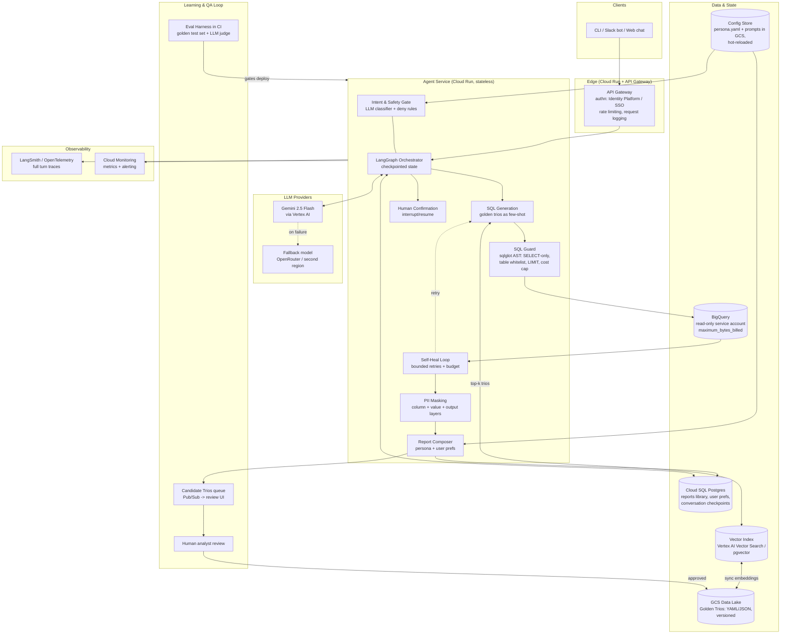
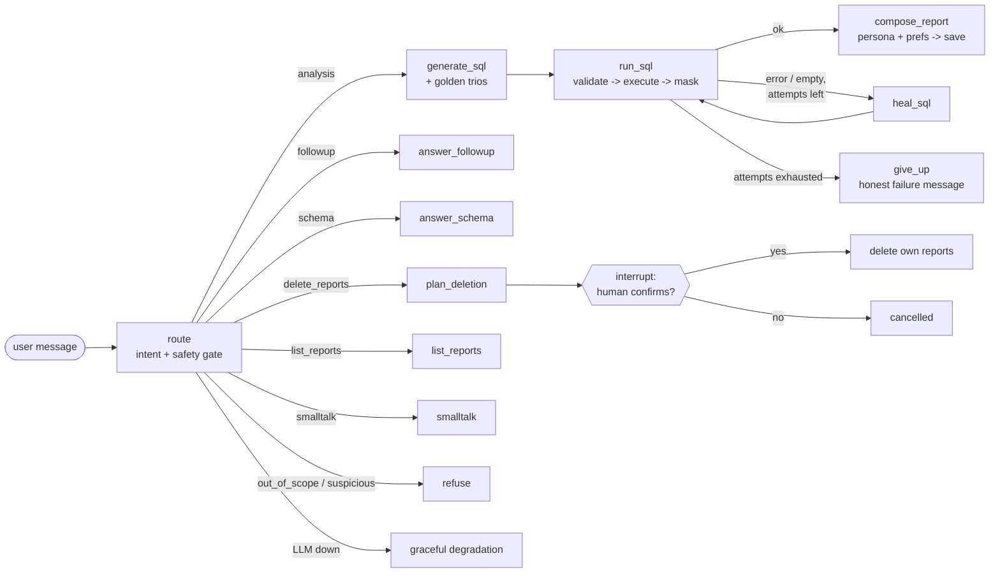

# Architecture - Data Analysis Chat Assistant

An internal data agent that lets non-technical retail executives ask questions about
sales, inventory and performance in natural language, discuss the results, and manage
a library of saved reports - safely.

This document covers the production High-Level Design, the reasoning behind every
technology choice, the data flows, and how each requirement is addressed. The
[README](../README.md) covers running the prototype.

---

## 1. Production High-Level Design

### Prototype agent graph (LangGraph, implemented in `src/agent/graph.py`)

---

## 2. Technology choices and reasoning

| Component | Choice | Why |
|---|---|---|
| Orchestration | **LangGraph** | The flow is a state machine with cycles (self-heal) and a human-in-the-loop pause (deletion). LangGraph gives exactly that: typed shared state, conditional edges, bounded cycles, `interrupt()`/`Command(resume=...)` for confirmations, and checkpointing for multi-turn memory - all without hand-rolling a control loop. |
| LLM | **Gemini 2.5 Flash** (Vertex AI in prod, AI Studio key in prototype) | Strong SQL generation, 1M-token context (schemas + trios fit easily), very low cost/latency - the agent makes 2-4 LLM calls per turn, so per-call economics matter. One model for all steps keeps the prototype simple; in production the router can drop to Flash-Lite and the report writer can move up to Pro without any code change (model name is config). |
| LLM resilience | `with_fallbacks` -> **OpenRouter** (any OpenAI-compatible model) | Provider outage or rate-limit exhaustion fails over automatically mid-turn. Each provider also retries transient errors internally (`max_retries=2`). |
| Warehouse | **BigQuery** (read-only service account) | Mandated by the dataset; also the right tool: serverless, per-query cost caps (`maximum_bytes_billed`), free dry-runs used by the heal loop. |
| SQL safety | **sqlglot** AST validation | Deterministic, dialect-aware parsing catches stacked statements, DML/DDL and non-whitelisted tables regardless of comments/casing tricks - things regex denylists miss. Also transpiles BigQuery SQL to DuckDB for the offline demo backend. |
| Golden bucket storage | **GCS** (prototype: local YAML files) | Trios are small immutable documents; object storage + versioning is the natural data-lake home. Reviewable via PRs or a small approval UI. |
| Golden bucket retrieval | **Vector search** (Vertex AI Vector Search or pgvector; prototype: BM25) | Question similarity is semantic. The prototype uses dependency-free BM25 behind the same `retrieve(question, k)` interface, so swapping in embeddings changes one class. pgvector is preferred at small scale - it lives inside the Postgres you already run. |
| App state | **Cloud SQL Postgres** (prototype: SQLite) | Reports library, user preferences, and LangGraph checkpoints are relational, transactional, owner-scoped data. Same schema in prototype and production. |
| Persona & prompts | **Plain files in a config bucket, hot-reloaded** | Non-developers edit `persona.yaml`; the loader re-reads on mtime change every turn - tone changes apply on the next message with no redeploy. |
| Observability | **Structured JSONL traces** (prototype) -> LangSmith/OpenTelemetry + Cloud Monitoring (prod) | Every turn gets a trace ID with per-node spans (SQL text, attempts, rows, masked columns, tokens, latency, outcome). The span structure is identical locally and in prod. |
| Compute | **Cloud Run** | The agent service is stateless (state lives in Postgres/checkpoints), so it scales to zero, deploys in seconds, and gives per-revision rollback for prompt-adjacent code changes. |

### Extensibility (new capabilities & data sources)

- **New data source** = one class implementing `DatabaseClient` (`execute`, `get_schemas`). The DuckDB demo backend is a working proof - it even transpiles the dialect.
- **New capability** (charts, e-mail reports) = one new graph node + one intent label in the router prompt. E.g. `generate_chart` consumes the same masked DataFrame the report node uses; `email_report` is another `interrupt()`-confirmed action like deletion.
- **New client surface** (Slack, web) = a thin adapter over the same graph; the CLI is ~150 lines and holds no business logic.

---

## 3. Data flow of one analysis turn

1. **Ingress** - the authenticated user's message arrives; a turn trace opens. The user ID comes from the session, never from model output.
2. **Route (gate)** - one cheap LLM call classifies intent and flags suspicious input (injection, requests for contact data, non-analysis asks). Suspicious -> templated refusal, nothing else runs.
3. **Retrieve** - top-k golden trios by similarity to the question; injected into the SQL prompt as worked examples ("how analysts interpreted questions like this"), alongside the live schema.
4. **Generate SQL** - the model returns one BigQuery SELECT.
5. **Guard** - sqlglot AST check: single statement, read-only, whitelisted tables, LIMIT enforced. Violations don't reach the database.
6. **Execute** - dry-run first (free syntax check + scan estimate vs byte budget), then the real query under `maximum_bytes_billed`.
7. **Heal if needed** - any execution error or an empty result loops back with the error text (max 3 total attempts **and** a per-turn LLM-call budget). Exhausted -> an honest failure message; the UI never crashes.
8. **Mask** - deterministic PII redaction of the result *before it enters any LLM context*: PII-named columns blanked, regex sweep over every text cell.
9. **Compose report** - persona (hot-reloaded) + this user's stored preferences + masked results -> Markdown report. A final regex sweep over the output is the last line of defense.
10. **Persist & learn** - report auto-saved to the user's library; the (question, SQL, report) triple is written to the candidates queue for analyst review; trace closes with an outcome label.

---

## 4. How each requirement is addressed

### 4.1 Hybrid Intelligence (Golden Bucket)

**At query time:** the bucket is indexed (embeddings in prod, BM25 in the prototype); the top-3 trios most similar to the user's question are injected into the SQL-generation prompt as complete worked examples. This transfers *analyst interpretation*, not just syntax - e.g. the convention that "revenue" excludes cancelled/returned items, or that regional underperformance is diagnosed by decomposing revenue into customers x frequency x basket size. The matching trio reports also shape the final report's structure.

**Updating over time:** every successful interaction is written to a **candidates** area (`golden_bucket/candidates/` in the prototype; a Pub/Sub-fed review queue in prod) with `status: pending_review`. A human analyst approves, edits or rejects candidates; approved ones are promoted into the versioned golden set and re-indexed. Curation signals: user feedback (thumbs up / "saved and reused"), eval-set coverage gaps, and deduplication against existing trios. Bad trios are the main quality risk of this pattern, which is why promotion is human-gated while *collection* is automatic.

### 4.2 Safety & PII Masking

Layered, and deterministic (code, not prompt requests):

1. **Intent gate** - non-analysis and suspicious requests (prompt injection, "dump customer emails") are refused before any retrieval or SQL runs.
2. **SQL guard** - AST-level read-only enforcement, table whitelist, single statement, LIMIT. The prompt also discourages selecting contact columns, but nothing relies on the prompt.
3. **Column-layer masking** - result columns matching PII name patterns (`email`, `phone`, ...) are replaced with redaction tokens **before the data enters any LLM context**. The model cannot leak what it never saw.
4. **Value-layer masking** - regex sweep (emails, phone numbers) over every text cell catches PII hiding in free-text columns.
5. **Output-layer masking** - the final report is swept again; even a fully jailbroken model cannot emit a raw email/phone to the user.
6. The DB credential is **read-only** at the IAM level - the ultimate backstop.

Verified by unit tests and by eval cases that explicitly request contact data and assert (regex) that none appears in the answer.

### 4.3 High-Stakes Oversight (destructive ops)

"Delete all reports mentioning Client X" / "...made today" flows through `plan_deletion`:

1. The router extracts structured deletion criteria (text filter, resolved absolute date).
2. Matching reports are searched **scoped to the authenticated user's ID** - taken from the session, never from model output, so a user can only ever delete their own reports (enforced again in the SQL `DELETE ... WHERE user_id = ?`).
3. The graph pauses via LangGraph `interrupt()`, showing the exact list of reports to be deleted.
4. Only an explicit "yes" resumes with approval; anything else cancels. No match -> clear "nothing to delete".

UX stays conversational - the confirmation is just one more chat exchange, and the paused state survives because the graph is checkpointed. In production, deletions are additionally soft-deletes with an audit log and a retention window.

### 4.4 Continuous Improvement

- **User level:** a preference store per user (`format: tables`, `detail_level: brief`, ...). A cheap heuristic gate (regex for "prefer/always/format/...") decides when to spend one extra LLM call extracting durable preferences from a message; extracted preferences are upserted and injected into every future report prompt. Manager A gets tables; Manager B gets bullets - persistently, across sessions.
- **System level:** the candidate-trio loop (§4.1) turns good interactions into future few-shot knowledge. Additionally, trace outcomes (`healed_then_answered`, `failed`) identify question patterns the SQL generator struggles with - the highest-value targets for new golden trios; in production this analysis runs as a scheduled job over the trace store.

### 4.5 Resilience & Graceful Error Handling

| Failure | Handling |
|---|---|
| SQL syntax/semantic error | BigQuery dry-run catches it **for free** (no bytes billed); error text feeds the heal prompt; bounded retries. |
| Empty result | Treated as healable once ("relax the most restrictive filter / check literal spelling"); if still empty, the report states it honestly and suggests a refinement. |
| Runaway loops / cost inflation | Two independent bounds: `MAX_SQL_ATTEMPTS` (3) and a per-turn LLM-call budget (`MAX_LLM_CALLS_PER_TURN`, 8) that hard-stops the turn. Query spend is capped by `maximum_bytes_billed` per query. |
| LLM provider down / rate-limited | Per-provider internal retries -> automatic failover to the fallback provider (`with_fallbacks`) -> if all providers fail, a clear "temporarily unavailable, please retry" message. The turn degrades; the process never dies. |
| BigQuery outage | Normalized `DatabaseError` surfaces as a graceful failure message; the trace records it as an infrastructure (not model) failure for alerting. |
| Anything unexpected | A top-level handler in the chat loop converts any exception into an apologetic message + trace record. The UI never crashes. |

### 4.6 Quality Assurance

**Before deployment** (`evals/run.py`, wired as a CI gate):
- A golden **eval set** of questions with deterministic assertions: expected routing outcome, tables the SQL must touch, content the answer must contain, and regex patterns that must *never* appear (PII). Runs against the demo DB in CI (hermetic, fast) and against BigQuery pre-release.
- Unit tests pin the deterministic safety layers (SQL guard, PII masker, owner-scoped deletion) - 28 tests in the prototype.

**Verifying reports answer user intent** (production additions):
- **LLM-as-judge** grading each eval answer for faithfulness (every number traceable to the query result - anti-hallucination) and intent coverage, with judge scores tracked per release.
- **Trio-consistency checks**: questions that match a golden trio closely must produce SQL whose result agrees with the trio's approach (same grain, same exclusions).
- **Human feedback online**: thumbs up/down per report feeds both the eval set (failures become regression cases) and golden-bucket curation.
- Prompt/model changes ship behind the eval gate: a release that drops the pass rate does not deploy.

### 4.7 Observability

Every turn produces a structured trace (`logs/traces.jsonl` locally; LangSmith/OpenTelemetry in prod) with per-node spans: intent, retrieved trios, each SQL attempt with its error, bytes scanned, rows returned, masked columns, token usage, latency, and a final **outcome label** (`answered`, `healed_then_answered`, `failed`, `refused`, `delete_confirmed`, `budget_exceeded`, `llm_unavailable`, ...).

**Metrics to alert on** (derived from outcomes/spans):
- answer success rate; self-heal rate (leading indicator of schema drift or prompt regression); give-up rate
- refusal rate (spike = attack or over-blocking); PII-mask hit count (should be ~stable)
- p50/p95 turn latency; LLM tokens & BigQuery bytes per turn (cost)
- provider failover count; unhandled-error count (page on any)

**Deep-dive debugging:** the trace ID ties the full message correspondence together - what the user asked, how it was routed, every SQL attempt and error, what data (post-masking) the model saw, and what it answered. A failing turn is replayable step by step: `--debug` streams spans live in the CLI; production uses the LangSmith trace UI for the same thing.

### 4.8 Agility (Persona Management)

`config/persona.yaml` (tone, audience, report style, extra instructions) and all prompts (`prompts/*.md`) are plain files re-read on every turn with mtime-based caching. A non-developer edits the YAML - the very next answer uses the new tone; no restart, no redeploy. In production the same loader points at a config bucket with change history and an optional approval step; the eval gate (§4.6) can run against a persona change too, since prompts are data, not code.

---

## 5. Prototype ↔ production mapping

| Concern | Prototype (this repo) | Production |
|---|---|---|
| Chat surface | CLI (`rich`) | Slack bot / web chat over the same graph |
| Agent runtime | Local process | Cloud Run (stateless, autoscaled) |
| Warehouse | BigQuery **or** offline DuckDB demo | BigQuery, read-only SA |
| Trio storage | Local YAML | GCS, versioned + review UI |
| Trio retrieval | BM25 (dependency-free) | pgvector / Vertex AI Vector Search |
| Reports & prefs | SQLite | Cloud SQL Postgres (+ soft delete, audit log) |
| Conversation memory | In-memory checkpointer | Postgres checkpointer |
| Traces | JSONL file | LangSmith / OpenTelemetry + Cloud Monitoring alerts |
| Persona/prompts | Local files, hot-reload | Config bucket, hot-reload + approval |
| Auth | `--user` flag (simulated identity) | SSO via Identity Platform; user ID from the token |

The seams are deliberate: each row is one interface with two implementations, so "growing up" is configuration, not rewrites.
